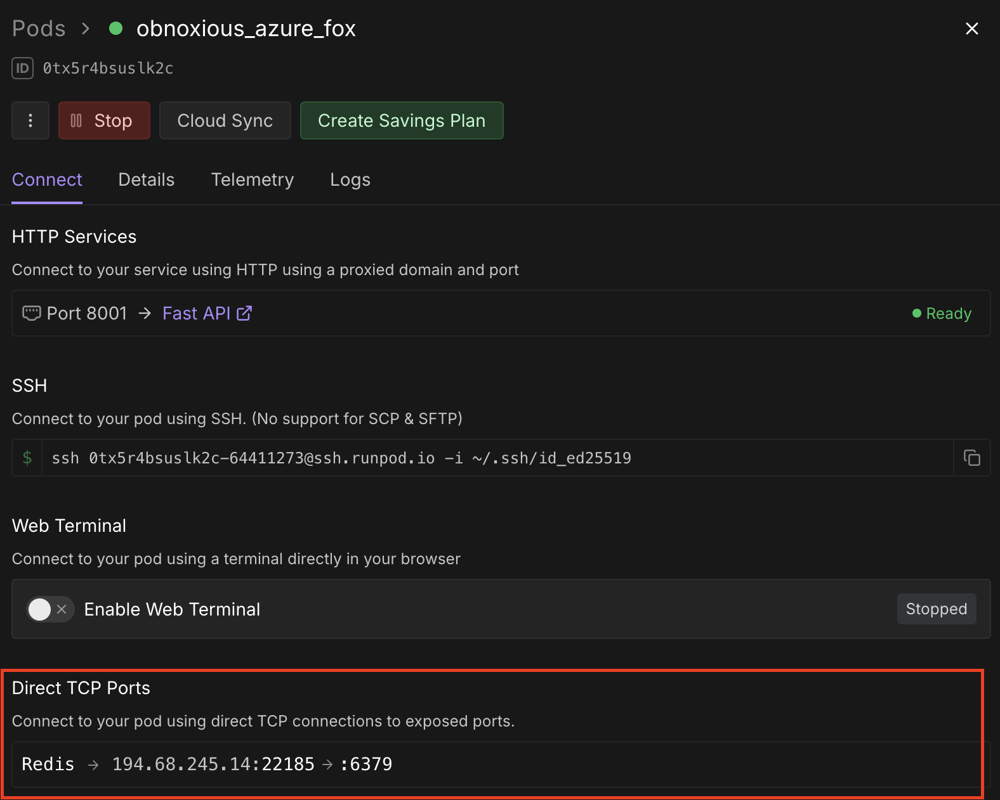
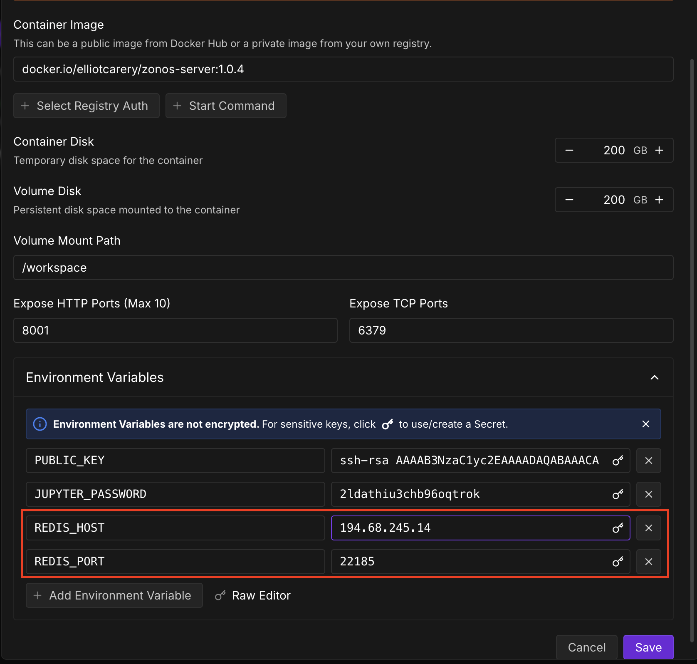
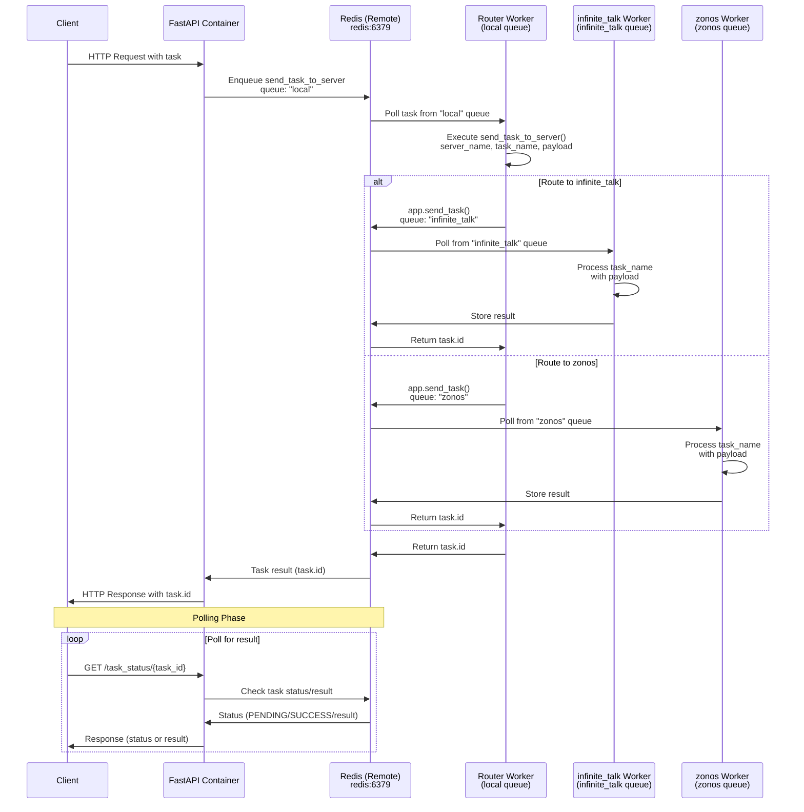

# AI Avatar Factory

**Create and manage AI-powered avatars with ease.**

[](https://aafactory.xyz/)
[](https://discord.gg/C2Rjy8Q2ER)

---

## Tutorial video

[](https://www.youtube.com/watch?v=YRMNtwCiU_U)

Official quick-start walkthrough (10 min). Follow along to clone the repo, configure Redis (local or remote), start services with Docker Compose, and create your first AI avatar.

---

## What is AI Avatar Factory?

AI Avatar Factory is a platform for creating and managing AI avatars. Whether you're building virtual assistants, digital characters, or interactive AI personalities, this tool provides an easy-to-use interface with powerful video editing capabilities.

**Key Features:**

- 🎭 Create custom AI avatars
- 🎬 Built-in video editor
- 🤖 Support for multiple AI models
- 🚀 Easy deployment with Docker
- 🌐 Remote Redis support for distributed processing

---

## Getting Started

### Prerequisites

- [Docker Desktop](https://www.docker.com/products/docker-desktop/) installed
- (Optional) Remote Redis server for distributed processing

### Quick Start (5 minutes)

**1. Download the code**

```bash
git clone <repository-url>
cd aafactory
```

**2. Configure Redis (Important)**

You can use either local or remote Redis:

**Option A: Local Redis (Development)**

```bash
docker-compose --profile local up
```

**Option B: Remote Redis (Recommended for Production)**

Remote Redis enables distributed processing across multiple servers. To connect:

1. Get your Redis URL from your remote server (e.g., RunPod dashboard):

   

2. Start the application and set the redis URL in the frontend settings:

   ```bash
   docker-compose --profile local up
   ```

3. Share the same Redis URL with other running instances for distributed processing:

   

**3. Access the application**

Once running, access these services:

- **Frontend**: http://localhost:3000
- **Backend API**: http://localhost:8000
- **API Documentation**: http://localhost:8000/docs
- **Celery Flower (Task Monitor)**: http://localhost:5556

### Stopping the Application

Press `Ctrl+C` in the terminal, then run:

```bash
docker-compose down
```

---

## Service Architecture

### Core Services

| Service     | Port  | Purpose                   |
| ----------- | ----- | ------------------------- |
| Frontend    | 3000  | Next.js user interface    |
| Backend API | 8000  | FastAPI REST API          |
| MongoDB     | 27017 | Database                  |
| Redis       | 6379  | Cache & message broker    |
| Flower      | 5556  | Task monitoring dashboard |

### System Flow



---

## Advanced Usage

### Docker Compose Profiles

Run different combinations of services based on your needs:

| Profile           | Command                                       | Services                              |
| ----------------- | --------------------------------------------- | ------------------------------------- |
| **Full Local**    | `docker-compose --profile local up`           | Frontend + Backend + Database + Queue |
| **Frontend Only** | `docker-compose --profile frontend up`        | Next.js app + MongoDB                 |
| **Backend Only**  | `docker-compose --profile backend-local up`   | API + Redis + Celery                  |
| **Everything**    | `docker-compose --profile local --profile up` | All services                          |

### Useful Commands

**View logs from a specific service:**

```bash
docker-compose logs -f backend
```

**Restart a single service:**

```bash
docker-compose restart frontend
```

**Rebuild after updates:**

```bash
docker-compose --profile local up --build
```

**Check running containers:**

```bash
docker-compose ps
```

**Clean everything and start fresh:**

```bash
docker-compose down -v
docker system prune -a
```

---

## Testing

AI Avatar Factory includes comprehensive testing capabilities for unit tests, React hooks, and end-to-end tests.

### Running Tests

**1. Start the application in test mode:**

```bash
docker-compose --profile local --env-file .env.test up
```

This starts all services using the test environment configuration.

**2. Run tests:**

Once the application is running, you can execute different test suites:

#### Unit Tests

```bash
# Run unit tests once
npm run test:unit

# Run unit tests in watch mode (auto-rerun on changes)
npm run test:unit:watch
```

#### React Hooks Tests

```bash
# Run hook tests once
npm run test:hooks

# Run hook tests in watch mode
npm run test:hooks:watch
```

#### End-to-End Tests

```bash
# Run E2E tests (headless Chrome)
npm run test:e2e

# Run E2E tests with UI mode (interactive)
npm run test:e2e:ui

# Run E2E tests in headed mode (visible browser)
npm run test:e2e:headed

# Debug E2E tests (step through with Playwright Inspector)
npm run test:e2e:debug

# View test report from last run
npm run test:e2e:report

# Generate E2E tests interactively
npm run test:e2e:codegen
```

#### Database Seeding

```bash
# Seed the database with test data
npm run db:seed
```

### Test Configuration Files

- **vitest.config.ts** - Unit test configuration
- **vitest.config.hooks.ts** - React hooks test configuration
- **playwright.config.ts** - E2E test configuration
- **.env.test** - Test environment variables

### Testing Best Practices

1. **Always use test environment**: Run tests with `.env.test` to avoid affecting production data
2. **Seed before E2E tests**: Run `npm run db:seed` before E2E tests to ensure consistent test data
3. **Watch mode for development**: Use watch mode during active development for instant feedback
4. **UI mode for debugging**: Use `test:e2e:ui` to visually inspect and debug E2E test failures
5. **Generate tests**: Use `test:e2e:codegen` to record user interactions and generate test code

---

## Technology Stack

- **Frontend**: Next.js, TypeScript, Tailwind CSS, Fabric.js
- **Backend**: FastAPI, Python, UV package manager
- **Database**: MongoDB
- **Queue**: Celery with Redis
- **Deployment**: Docker Compose

### Project Structure

```
aafactory/
├── frontend/          # Next.js application
├── backend/           # FastAPI server
├── docker-compose.yml # Service orchestration
└── README.md         # This file
```

---

## Troubleshooting

**Port already in use?**

```bash
# Find what's using the port
lsof -i :3000
# Kill it or change the port in docker-compose.yml
```

**Container won't start?**

```bash
# View detailed error logs
docker-compose logs [service-name]
```

**Need to reset everything?**

```bash
docker-compose down -v
docker system prune -a
```

**Still stuck?**
Join our [Discord](https://discord.gg/C2Rjy8Q2ER) for help!

---

## Contributing

We welcome contributions! Join our [Discord community](https://discord.gg/C2Rjy8Q2ER) to:

- Ask questions and get support
- Report bugs and suggest features
- Share your avatars and projects
- Collaborate with other developers

---

## Credits

Video editor component based on [fabric-video-editor](https://github.com/AmitDigga/fabric-video-editor).
